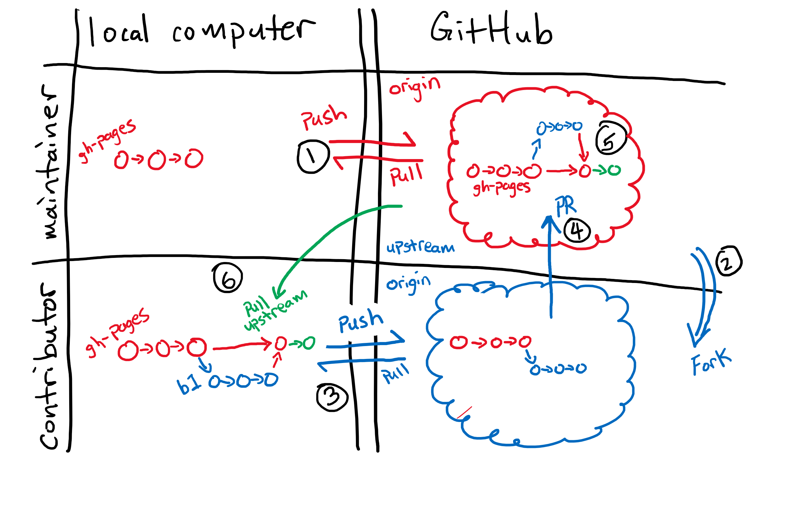

## Maintainers and Forked Repositories

Congratulations! You're a lesson Maintainer!
If this is the first time you are maintaining a project where you and other people are going to be submitting changes
there are two perspectives you need to keep in mind:
one of the "contributor" and one of the "maintainer".

- Contributors: cannot directly `push` code to the repository
- Maintainers: *can* directly `push` code to the repository

### Our recommended workflow: Pushing and pulling to a remote (non-fork)

The 
[Software Carpentry Git lesson](https://swcarpentry.github.io/git-novice/) and
[Library Carpentry Git lesson](https://librarycarpentry.org/lc-git/)
show you how you can interact with a repository from an owner and maintainer point of view
because you are allowed to `push` directly to your project on GitHub (see label 1)

As a maintainer to one of our lessons,
you will be able to interact with the lesson just like it was your own repository (see label 1).
The only difference is the account the repository is under.
So instead of `username/repo` it will be something along the lines of `carpentries/repo`.
This means when you get the `git clone` url, you will have to get it from the `carpentries/repo` location,
not your own.

In this setup, since you are `clone`ing down from the original `carpentries` repo,
the remote will be your `origin`.
Again, this is same workflow as if you are working on your own personal repository,
and you can `git push origin gh-pages` as normal.

> ## An alternative workflow: Pushing and pulling to a remote (fork)
> 
> Some maintainers choose to work using the forking model of collaboration.
> Even though they have access to the original "upstream" Carpentries repository,
> they will make a "fork" of the Carpentries repository so they have a copy (i.e., fork) in their own account
> (see label 2).
> Using this workflow gives you (the Maintainer) the same workflow as any other contributor to your lesson
> (since contributors will also need to work on a fork).
> 
> Once you fork the repository, there will be the original "upstream" `carpentries/repo` and your own "fork", `username/repo` (see label 2).
> You can `clone` your `username/repo` down to your computer like any other repository you want to work on locally and push and pull your changes to your remote (label 3).
> Because the repository you `clone`d from is your own "fork" (`username/repo`),
> the version in your account that you cloned from is the "origin" repository (see the blue colored "origin" label in the diagram).
> You can then issue a pull request (PR) to the original `carpentries/repo` repository (see label 4).
> 
> For PRs from non-maintainers you will review these changes and ask for changes if needed.
> As the maintainer, you can review and/or accept these PRs (including your own)
> because as a maintainer you will have the repository permissions (in `carpentries/repo`)
> to accept the PR (see label 5).
> 
> As more changes come in and get accepted, from other contributors and accepted by you or other maintainers,
> the forked repository (bottom right quadrant) and your own local copy (bottom left quadrant) will be out of sync.
> You won't be able to "fork" the original `carpentries/repo` again, so you will need to set the original `carpentries/repo` as
> *another* remote to get things synced up.
> You do this by adding the original `carpentries/repo` repository as another remote, typically named `upstream` (see blue text).
> To syncronise the work so your local and remote copy, you will `git pull upstream gh-pages` to get the upstream changes (see green label 6),
> and then `git push origin gh-pages` to synconise your own forked remote (i.e., GitHub) copy.
{: .callout}

## Demo + Exercise

For both of these exercise work in at least groups of 2:
"M" will be refered to as the "maintainer", "C" will be a "contributor".

1. M: Create a repository: `<date>-collab-example` and create it with at least a `README.md` file so the repository is not completely empty.

> ## Practice using the non-fork workflow: Part 1
> 
> Working on the `gh-pages` branch
> 
> 1. M: Add C as a collaborator under the repository settings.
> 2. C: Accept the collaboration invitation (look in your e-mail)
> 3. M + C: `clone` the repository to your local machine
> 4. M + C: Both add your name to the `README.md` file
> 5. M + C: `add` and `commit` your changes
> 6. M + C: `push` your changes to the remote
> 7. M + C: someone will have a merge conflict
{: .challenge}

> ## Practice using the non-fork workflow: Part 2
> Repeat but using a branch
> 
> 1. Make sure that your local version is up-to-date: `git pull origin gh-pages`
> 2. Create a new branch: `git checkout -b BRANCH_NAME` or `git switch -c BRANCH_NAME`
> 3. Make changes, `add`, `commit`, and `push` the changes
> 4. Create a PR
{: .challenge}

> ## Practice using the fork workflow (Optional)
> 
> Working on the `gh-pages` branch
> 
> 1. C: fork the repository from M
> 2. C: `clone` from your respitory (`c/<date>-collab-example`)
> 3. M + C: Both add your name to the `README.md` file
> 4. M + C: `add` and `commit` your changes
> 5. M + C: `push` your changes to the remote (C: it will be your `origin`)
> 6. C: Issue the PR
> 7. M: Review and merge the PR
> 8. C: Setup the upstream remote
> 9. C: Sync the upstream changes to your local machine and your fork
> 
> Repeat but using a branch
> 
> 1. Make sure that your local version is up-to-date: `git pull origin gh-pages`
> 2. Create a new branch: `git checkout -b BRANCH_NAME` or `git switch -c BRANCH_NAME`
> 3. Make changes, `add`, `commit`, and `push` the changes
> 4. Create a PR
> 5. M: Review and merge the PR
> 6. C: Setup the upstream remote
> 7. C: Sync the upstream changes to your local machine and your fork
{: .solution}

How to handle images - where to put the files and how to link to them.
Be aware that the lesson template is nearing a new release. Decide whether you want to be involved in beta testing or wait for official release. 
Different callout boxes used in our lessons and when to use them. 

> ## Exercise
> Identify the file and lines of the file that control the following output for your lesson. Add the file name and copy the relevant lines 
> (or just add line numbers?) to the Etherpad. 
> - Instructor notes
> - Setup instructions
> - Questions
> - Timings
> - Learning objectives
> - Key points 
> - Glossary
{: .challenge}

Edit nested challenge blocks / solutions. 
Write a challenge block with solution and proper code formatting. 

## Style Maintenance

The template for Carpentries lessons is managed through the [styles
repository](https://github.com/swcarpentry/styles), which is maintained by the
[Lesson Infrastructure Committee](https://carpentries.org/lesson-infra/). The
activity of the Committee was put on hold during the COVID-19 pandemic but is
set to resume in the second half of 2021. In the meantime, the [Curriculum
Team](https://carpentries.org/core-team-projects/#curriculum-team), with the
help of [Maxim Belkin](https://github.com/maxim-belkin), has been maintaining
this repository.

