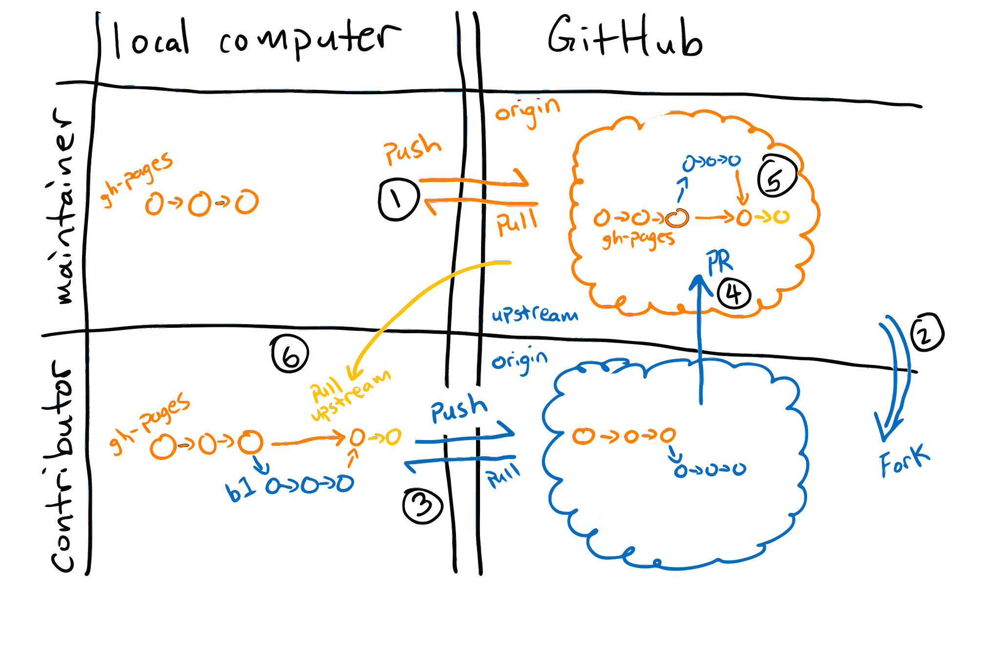

## Maintainers and Forked Repositories

::::::::::::::::::::::::::::::::::::::: objectives

- Understand the structure of the lesson source repository---know which elements generate the various parts of the lesson page.
- Navigate to the correct file and element to update each section---including instructor notes, setup, questions, timings, learning objectives, key points, and glossary.
- Be familiar with the various callout boxes used in Carpentries lessons and be able to use them appropriately.

::::::::::::::::::::::::::::::::::::::::::::::::::

:::::::::::::::::::::::::::::::::::::::: questions

- How do I review pull requests?
- How do I make changes to pull requests?
- How do I accept pull requests?
- What should I know about how the lessons are formatted?

::::::::::::::::::::::::::::::::::::::::::::::::::

If this is the first time you are maintaining a project where you and other people are going to be submitting changes
there are two perspectives you need to keep in mind:
one of the "maintainer" and one of the "contributor".

- Maintainers: can directly `push` code to the repository
- Contributors: *cannot* directly `push` code to the repository, and need to create a separate fork

{alt='Diagram illustrating workflows for pushing and pulling to a remote for Maintainers and contributors.'}

### Pushing and pulling directly to the remote repository owned by The Carpentries

The
[Software Carpentry Git lesson](https://swcarpentry.github.io/git-novice/) and
[Library Carpentry Git lesson](https://librarycarpentry.org/lc-git/)
show you how you can interact with a repository from an owner and Maintainer point of view
because you are allowed to `push` directly to your project on GitHub (see label 1 in the above
diagram).

As a Maintainer to one of our lessons, you will be able to interact with the lesson just like it was
your own repository (see label 1 in the above diagram). The only difference is the account the
repository is under. So instead of `username/repo` it will be something like `carpentries/repo`.
This means when you get the `git clone` url, you will have to get it from the `carpentries/repo`
location, not your own.

In this setup, since you are `clone`ing down from the original `carpentries` repo,
the remote will be your `origin`.
This is the same workflow as if you are working on your own personal repository,
and you can `git push origin gh-pages`.

:::::::::::::::::::::::::::::::::::::::::  callout

## An alternative workflow: Pushing and pulling to a remote (fork)

Some Maintainers choose to work using the forking model of collaboration. Even though they have
access to the original "upstream" Carpentries repository, they will make a "fork" of The
Carpentries repository so they have a copy (i.e., fork) in their own account (see label 2 in the
above diagram). Using this workflow gives you (the Maintainer) the same workflow as any other
contributor to your lesson (since contributors will also need to work on a fork).

### Forking a Repository

To fork a repository on GitHub, you can visit a repository and add `/fork` at the end of the URL
or you can click the "fork" button in the top right:

{alt='Screenshot of the top bar of swcarpentry/git-novice with four buttons on the top right: sponsor,watch, fork, and star'}

Once you fork the repository, there will be the original "upstream" `carpentries/repo` and your
own "fork", `username/repo` (see label 2). When you visit your fork on the GitHub website, you
will see a grey toolbar above the file list that says "This branch is up to date with
carpentries/repo:branch."

{alt='Screenshot of grey box above a file list on github that says "This branch is up to date with swcarpentry/git-novice:gh-pages." It has two buttons, one labelled "Contribute" and the other labelled "Fetch Upstream"'}

You can `clone` your `username/repo` down to your computer like any other repository you want to
work on locally and push and pull your changes to your remote (label 3). Because the repository
you `clone`d from is your own "fork" (`username/repo`), the version in your account that you
cloned from is the "origin" repository (see the blue colored "origin" label in the diagram). You
can then issue a pull request (PR) to the original `carpentries/repo` repository (see label 4).

For PRs from non-maintainers you will [review these changes](https://docs.github.com/en/pull-requests/collaborating-with-pull-requests/reviewing-changes-in-pull-requests/reviewing-proposed-changes-in-a-pull-request) and ask for changes if needed. As the
Maintainer, you can review and/or accept these PRs (including your own) because as a Maintainer
you will have the repository permissions (in `carpentries/repo`) to accept the PR (see label 5).

### Keeping your fork up-to-date

As more changes come in from other contributors and accepted by you or other Maintainers, the
forked repository (bottom right) and your own local copy (bottom left) will be out of sync. This
time, when you visit your fork on GitHub, you will see that GitHub will show you that your branch
is `N commits behind` the upstream repository. You can use the "Fetch upstream" button to bring
those changes to your own repository.
{alt='Screenshot of grey box above a file list on github that says "This branch is 2 commits behindwith swcarpentry/git-novice:gh-pages." It has two buttons, one labelled "Contribute" and the otherlabelled "Fetch Upstream". The "Fetch upstream" button has been clicked to reveal a menu that says"Fetch and merge 2 upstream commits from swcarpentry:gh-pages" with subtext that says "Keep yourfork up-to-date-with the upstream repository" and a link that says "Learn More" There is a white"compare" button and a green "fetch and merge" button displayed'}

**If you wanted to perform this update locally**, you would set the `carpentries/repo` as a new remote
called "upstream" and then [pull the changes from upstream](https://docs.github.com/en/get-started/using-git/getting-changes-from-a-remote-repository#pulling-changes-from-a-remote-repository).


::::::::::::::::::::::::::::::::::::::::::::::::::

## Practice using the recommended workflow

We will now practice using the recommended workflow for pushing and pulling to a remote.

You will be assigned to a breakout group of 2-3 people. Once you are in breakout rooms, decide who
will play the role of the Maintainer ("M"), and who will be the contributor ("C").

:::::::::::::::::::::::::::::::::::::::  challenge

## Working on the `gh-pages` branch (10 minutes)

1. M: Create a repository: `<date>-collab-example` and initialise it with a `README.md` file so
  the repository is not completely empty.
2. M: Add C as a collaborator under the repository settings.
3. C: Accept the collaboration invitation (check your e-mail)
4. M + C: `clone` the repository to your local machine
5. M + C: Both add your name to the `README.md` file
6. M + C: `add` and `commit` your changes
7. M + C: `push` your changes to the remote
8. M + C: someone will have a merge conflict
  

::::::::::::::::::::::::::::::::::::::::::::::::::

:::::::::::::::::::::::::::::::::::::::  challenge

## Working on a new branch (15 minutes)

1. Make sure that your local version is up-to-date: `git pull origin gh-pages`
2. Create a new branch: `git checkout -b BRANCH_NAME` or `git switch -c BRANCH_NAME`
3. Make changes, `add`, `commit`, and `push` the changes
4. Create a PR
  

::::::::::::::::::::::::::::::::::::::::::::::::::

:::::::::::::::  solution

## Practice using the fork workflow (Optional)

Working on the `gh-pages` branch

1. C: fork the repository from M
2. C: `clone` from your respitory (`c/<date>-collab-example`)
3. M + C: Both add your name to the `README.md` file
4. M + C: `add` and `commit` your changes
5. M + C: `push` your changes to the remote (C: it will be your `origin`)
6. C: Issue the PR
7. M: Review and merge the PR
8. C: Setup the upstream remote
9. C: Sync the upstream changes to your local machine and your fork

Repeat but using a branch

1. Make sure that your local version is up-to-date: `git pull origin gh-pages`
2. Create a new branch: `git checkout -b BRANCH_NAME` or `git switch -c BRANCH_NAME`
3. Make changes, `add`, `commit`, and `push` the changes
4. Create a PR
5. M: Review and merge the PR
6. C: Setup the upstream remote
7. C: Sync the upstream changes to your local machine and your fork
  

:::::::::::::::::::::::::

:::::::::::::::::::::::::::::::::::::::  challenge

## Questions and Answers (5 minutes)

Please add questions to the Etherpad.


::::::::::::::::::::::::::::::::::::::::::::::::::

## The Carpentries Lesson Infrastructure

This is an exciting time for The Carpentries Lesson Infrastructure! We are in the midst of the 
official transition to a new infrastrucutre - [The Carpentries
Workbench](https://carpentries.github.io/workbench), which is designed to be more user friendly for
both contributors and Maintainers. All lessons will transition to using the workbench in 
May 2023. This section will teach you some of the most important elements of The Workbench that you will need
to interact with as a Maintainer. Full documentation can be found on [The Carpentries Workbench](https://carpentries.github.io/workbench/).

:::::::::::::::::::::::::::::::::::::::::  callout

## Important: Resolve All Open Pull Requests

In order to prepare lessons for The Workbench transtion, **all open pull requests must be merged or closed by 1 May**. 
The Carpentries Curriculum Team will be assisting
Maintainers across all of our lessons to ensure pull requests are resolved before the deadline. 

::::::::::::::::::::::::::::::::::::::::::::::::::


:::::::::::::::::::::::::::::::::::::::::  callout

## What Was "Styles"?

You may come across references to something called "Styles". Styles is the name for 
the infrastructure that was used for The Carpentries lessons from 2014 - May 2023. This 
infrastructure was managed through the [styles
repository](https://github.com/swcarpentry/styles), and documented on
the [lesson-example repository](https://carpentries.github.io/lesson-example/).

::::::::::::::::::::::::::::::::::::::::::::::::::


:::::::::::::::::::::::::::::::::::::::::  callout

## Who Maintains the Lesson Infrastructure?

Up until March 2020, the lesson infrastructure was maintained by the
[Lesson Infrastructure Committee](https://carpentries.org/lesson-infra/). The
activity of the Committee was put on hold during the COVID-19 pandemic and we are making concious
strategic decisions about how to re-form this committee ahead of May 2023.

The Lesson Infrastructure is currently maintained by the [Curriculum
Team](https://carpentries.org/core-team-projects/#curriculum-team), with the help of [Maxim
Belkin](https://github.com/maxim-belkin).


::::::::::::::::::::::::::::::::::::::::::::::::::

### Lesson homepage

The lesson homepage is built from the `index.md` file and provides an overview of the lesson,
including any prerequisites, an introduction to the dataset used, and any other information learners will need for the lesson.

The Instructor view of the lesson homepage also includes a schedule showing the individual episodes included in the lesson,
and the time allotted for each. The schedule is automatically created based on information present in
the episode files.

### Episodes

The majority of a lessons content is in its episode files. Episode files are stored in the
`_episodes/` folder within your lesson repo (or in `_episodes_rmd/` for lessons written in R).
Episode file names must start with a two-digit identifier number (e.g. `01`) followed by a short
descriptive name, separated by a dash (`-`). For example `02-loop.md`, `03-lists.md`. The numeric
identifier is used to place your episode files in the correct sequence within the lesson. Episode
files are written in *Markdown* or *RMarkdown*.

#### Episode headers

Each episode starts with a YAML header that looks something like this:

```
---
title: "What is the shell?"
teaching: 5
exercises: 0
---
```

The information stored in the YAML header is used by the lesson infrastructure to populate the schedule.

#### Questions, objectives, and keypoints

Each episode must contain one each of the following types of callouts: 

- Questions: Located at the top of the episode file, these are plain language questions that show learners what to expect to gain from the episode.
- Objectives: Located at the top of the episode file, objectives are specific goals that learners should be able to accomplish by the end of the episode.
- Keypoints: Located at the end of the episode file, key points are statements of the major take-aways learners should remember from each episode. 

Keypoints are automatically gathered from each episode and collected on the "Key Points" page of each lesson. Questions and Objectives are represented
in an "Overview" box at the top of each rendered episode page.

#### Instructor notes


:::::::::::::::::::::::::::::::::::::::  challenge

## Scavenger Hunt (5 minutes)

Identify the file and lines of the file that control the following output for The Carpentries 
[Instructor Training lesson](https://carpentries.github.io/instructor-training/).
Add the file name and copy the relevant lines to the Etherpad.

- Questions (for episode 1)
- Timings (for episode 1)
- Objectives (for episode 1)
- Key points (for episode 1)
- Instructor notes
- Setup instructions
- Glossary
  

::::::::::::::::::::::::::::::::::::::::::::::::::

For a step-by-step guide to how the lessons are structured, and what syntax to use to add code
chunks, exercises, and other elements, please read the [technological introductions
chapter](https://cdh.carpentries.org/technological-introductions.html) of The Carpentries Curriculum
Development Handbook.

:::::::::::::::::::::::::::::::::::::::: keypoints

- Make a branch to create a pull request.
- The Carpentries lessons share a consistent style, which is controlled by [styles](https://github.com/carpentries/styles) and documented in the [lesson-example](https://carpentries.github.io/lesson-example/)

::::::::::::::::::::::::::::::::::::::::::::::::::


